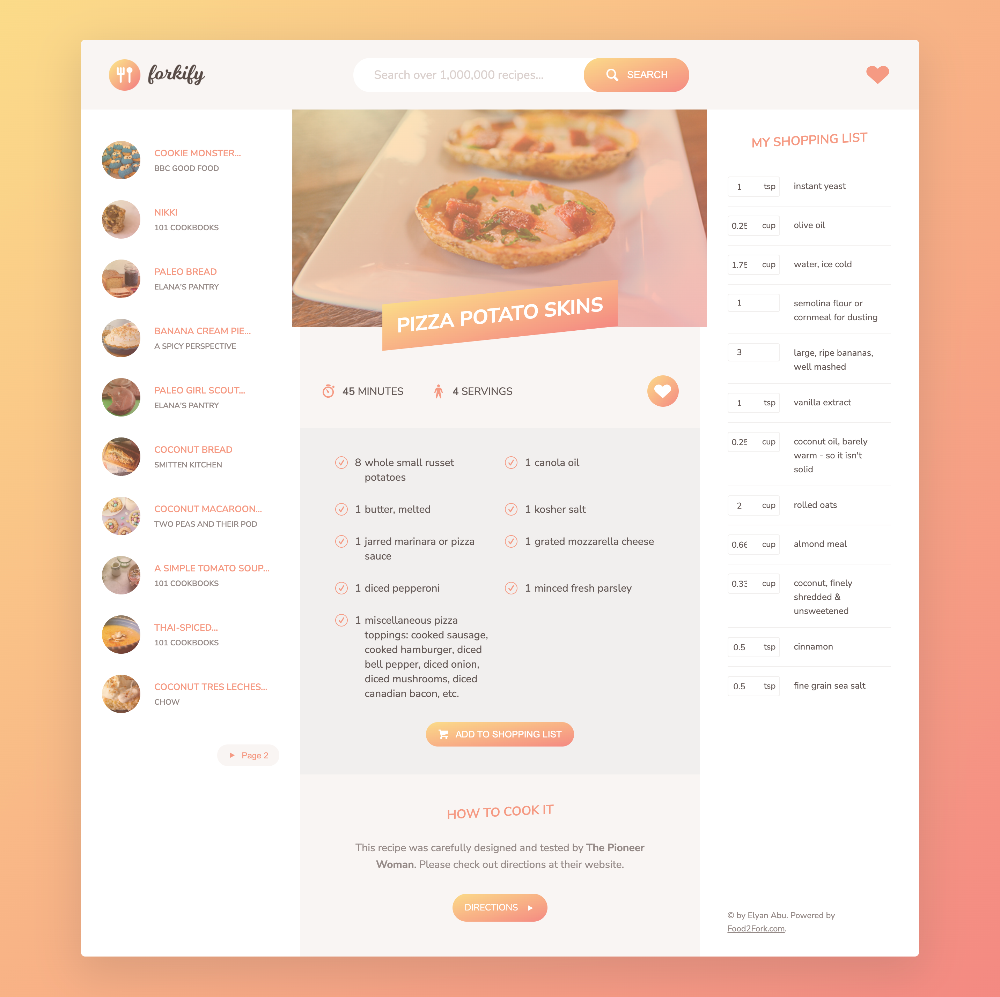

# Restuarant-web-app
Restuarant web-app that gets the type of meal and recipes from an external API. Built with web-pack, Babel, jquery, Ionic-framework, Materialise css and the Module design pattern

## Built With 🔨

- HTML5
- CSS
- Javascript
- Git & Github
- DOM
- Flexbox
- Grid
- web-pack
- NPM
- Babel
- jquery

## Live Demo 👀

[Live Demo Link]( https://resturant-web-app.netlify.app/)

### Install

To get a local copy up and running follow these simple example steps.
- Open terminal
- Clone this project by command git clone https://github.com/Geoelycom/Restuarant-web-app.git
- Cd Restuarant-web-app folder
- The Restuarant-web-app folder contains two folder of dist and src
- Open index.html in browser

## Getting Started 
- The project file contains the dist and src folder
- the Dist Folder contains all the bundled js that will be served to the client with babel
- the src folder contains the real js code, models and views of the whole App  and index.html file
- You will find seperate css files for both the bundled js and the raw js 
- img folder contains all the images and icons used in building this project(Icons are gotten from Flaticon). images are gotten from unsplash,MealDB api and Google.

### Prerequisites

- IDE to edit and run the code (I've used Visual Studio Code 🔥).

### Usage

- For anyone who wants to practice HTML5,CSS, FLEXBOX, JS, Babel, Es6  AND DOM MANIPULATION and responsive design.
- How to apply responsive desing using media query with good practices.

## Author

👤 **Ekenimoh Elyan (Geo)**

- GitHub:[@Geoelycom](https://github.com/Geoelycom)
- Twitter: [@Ely_codes](https://twitter.com/Ely_codes)
- LinkedIn: [Ekenimoh Elyan](https://www.linkedin.com/in/Ekenimoh_sumaila-elyan/)

## 🤝 Contributing

Contributions, issues, and feature requests are welcome!

Feel free to check the [issues page]().

## Show your support

Give a ⭐️ if you like this project!

## Acknowledgments

- Inspiration
- Jonas 2020 web-dev bootcamp
- myself 😏

## License
This project is [MIT](./mit.md) licensed.
